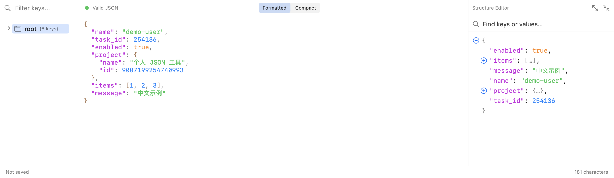
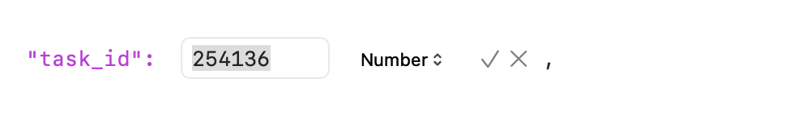
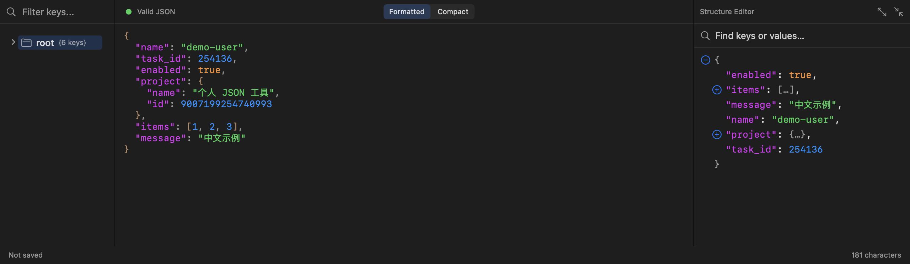
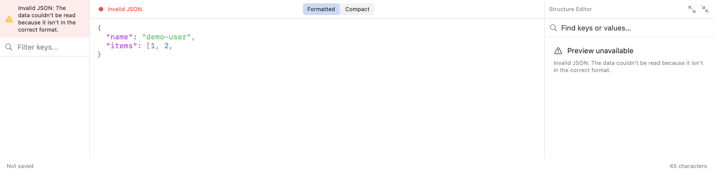

# JSONLook

Formerly **JSONav Personal**. A personal fork of [brettnielsen/JSONav](https://github.com/brettnielsen/JSONav),
with a native three-pane JSON editor and command-line import. This is an
independently maintained fork, not an official release of the upstream project.
JSONLook starts its own release numbering at **0.0.1**; earlier Personal builds
used a separate development version sequence.


<p align="center">
  
</p>

## Features

- **Three Panes** — Tree navigation, editable JSON source, and a foldable structure editor
- **Inline Field Editing** — Click an existing key or scalar value to edit it in place
- **Optional Sidebars** — Hide the tree or structure pane independently; drag dividers to resize
- **Tree View Navigation** — Collapsible sidebar displays your JSON structure at a glance
- **Syntax Highlighting** — Color-coded keys, strings, numbers, booleans, and nulls
- **Real-time Validation** — Instant feedback as you type with valid/invalid status
- **Cursor Sync** — Tree view highlights the node at your cursor position in the editor
- **Click to Navigate** — Click any node in the tree to jump to it in the editor
- **Format & Minify** — Toggle between pretty-printed and compact JSON
- **Dark Mode** — Full support for light and dark appearances
- **Drag & Drop** — Drop JSON files directly into the window
- **Native macOS** — Proxy icons, document editing state, keyboard shortcuts
- **Command-line Import (personal fork)** — Import JSON text, stdin or files into the running app with unsaved-document protection

## Installation

### Requirements

- Current project deployment target: **macOS 26.2 or later**.
- Local builds have been verified with **Xcode 27.0** on Apple Silicon.
- Xcode is needed to build; running an already-built app does not require Xcode.
- Older macOS/Xcode compatibility has not been validated for this personal fork.

### Build from Source

```bash
git clone https://github.com/blingmoon/JSONav.git
cd JSONav
open JSONav.xcodeproj
```

Use the build scripts below for the supported daily/Test installations.
Opening the project in Xcode is useful for development, but direct `⌘R` builds
retain upstream project signing/bundle settings and are not the packaged channels. Develop changes on a feature branch and merge
validated changes into your own `main` before tagging a release.

## Usage

| Action | Shortcut |
|--------|----------|
| New File | `⌘N` |
| Open File | `⌘O` |
| Save | Save toolbar button |
| Show/hide tree sidebar | Left-sidebar toolbar button |
| Show/hide structure editor | Right-sidebar toolbar button |
| Apply/cancel inline edit | `Return` / `Escape` |
| Toggle Dark Mode | Toolbar button |

### Tree View

The left panel shows your JSON as a navigable tree:

- **Click** a node to jump to its location in the editor
- **Filter** nodes using the search bar
- **Expand/collapse** objects and arrays with disclosure triangles

### Editor

The middle panel is the JSON source editor (the rightmost panel is the optional
structure editor):

- Syntax highlighting updates as you type
- Cursor position syncs with the tree view
- Validation indicator shows JSON status in real-time

### Structure Editor (personal fork)

The three panes are **tree navigation | JSON source editor | structure editor**.
Use the **Structure Editor** toolbar button (right-sidebar icon) to toggle the
third pane. The **Tree Sidebar** button (left-sidebar icon) hides or shows the
left pane independently. Both visibility preferences persist across launches.
Drag the dividers to resize the panes.

- Objects and arrays collapse to `{…}` and `[…]`; use the plus/minus buttons to expand or collapse them.
- Search keys or values in the preview. Matching branches expand automatically;
  use the arrows or Enter to move between matching rows. Clear search to restore
  manual folding. The count represents matching rows, not individual text occurrences.
- Click a field name or scalar value to edit it in place. Press **Return** (or ✓)
  to commit and **Escape** (or ×) to discard. Values may be strings, numbers, booleans or null;
  enter strings without surrounding quotes. Use the source editor to add/remove
  fields or replace whole objects and arrays.
- Each committed change replaces only the selected token in the source, marks the
  document modified, and supports undo/redo. Unrelated formatting and number tokens
  are preserved. Duplicate keys and stale edits are rejected rather than overwriting
  another field. Invalid JSON hides the structure view until parsing succeeds.
- Folding and searching do not modify the source or saved JSON.
- Tree and preview numbers retain Foundation's parsed numeric representation,
  avoiding the former conversion of all numbers to `Double`. Original number
  spelling and arbitrary-precision parsing are not guaranteed.

### Build the personal app locally

With Xcode installed:

```sh
bash scripts/test-local.sh          # Regression tests
bash scripts/build-local.sh test    # Install ~/Applications/JSONLook Test.app
bash scripts/build-local.sh release # Install /Applications/JSONLook.app
```

The default channel is `test`. Both channels use optimized Release builds with
local ad-hoc signatures and sandbox/user-selected-file access, without debug
entitlements. Their separate bundle identifiers isolate preferences and sandbox
data; the release identifier stays unchanged from the earlier personal app.
Quit the target app before installation to protect unsaved input. Installing
release archives matching old **JSONav Personal** installations; test builds archive
**JSONav Personal Test**. Bundle identifiers stay unchanged to retain existing
preferences and sandbox data.

Intermediate bundles and previous installations stay in `build/*.noindex`.
Open the installed apps directly from Applications; no build-folder navigation is
needed. The script does not change the system's selected developer directory.

### Command-line import

The renamed command is **`jsonlook`** (formerly `jsonav`). Update external callers
to use the new name. `build-cli.sh` archives a matching old command built by this
checkout; it leaves unrelated/custom executables untouched.

The companion `jsonlook` command accepts JSON as an argument, from stdin, or from a
file. It launches the selected app when necessary and also delivers new content
when the app is already running or its editor window is closed.

Install the test app and command from this checkout:

```sh
bash scripts/build-local.sh test
bash scripts/build-cli.sh
```

The command is installed at `/usr/local/bin/jsonlook`. If that directory is not on
PATH, use the full path as in these examples; shell configuration is not changed.

```sh
# Pass text directly (quote it for your shell)
/usr/local/bin/jsonlook --test --json '{"name":"demo-user","items":[1,2,3]}'

# Import a file as a new unsaved document; the source file is not modified
/usr/local/bin/jsonlook --test --file data.json

# Read stdin until EOF; suitable for large or multiline content
cat data.json | /usr/local/bin/jsonlook --test

# Allow more time for a user confirmation
/usr/local/bin/jsonlook --test --timeout 300 --file data.json

/usr/local/bin/jsonlook --help
```

`--test` targets **JSONLook Test** in `~/Applications`. Without it, the
command targets **JSONLook** in `/Applications`. Both identities are
checked explicitly; the default JSON file association is not used. Update the
daily app with `bash scripts/build-local.sh release` before omitting `--test`:
older versions without import support are refused. On another supported Mac, install the combined release package; rebuilding
from source is optional.

- Input must be UTF-8, at most **10 MiB**. Use stdin or a file for large input;
  command-line arguments are additionally subject to shell/OS size limits. The
  limit is not a rendering-performance guarantee for every JSON shape.
- Original text, whitespace and field order are retained without automatic
  formatting. Invalid JSON remains editable with an error. Tree/structure panes
  keep their existing sorted display.
- Imports are **Untitled, unsaved documents**. Save asks for a destination rather
  than writing back to the source or temporary handoff file.
- Unsaved edits require confirmation before replacement. There is one pending
  buffer; a new arrival asks whether to replace that buffer. Further requests
  during that decision are rejected explicitly, not silently queued or dropped.
- The command waits for the app's result. Default timeout is **120 seconds**;
  `--timeout` overrides it. A timeout does not cancel a pending import: the command
  reports the retained handoff path, which must not be deleted while still in use.

| Exit code | Meaning |
| --- | --- |
| `0` | Imported into the document; not saved to disk |
| `1` | Failure |
| `2` | Cancelled, replaced, or rejected because the receiver is busy |
| `3` | Timeout; the request may still complete |

Internally the command uses a private handoff file and macOS file-open events,
then reads the app's receipt before cleaning up its own file. No custom URL
scheme, clipboard read, or network service is involved. See [CLI import](docs/cli-import.md)
for the protocol, cleanup rules and acceptance checks.

### Install a release (no Xcode required)

After a version is published on [GitHub Releases](https://github.com/blingmoon/JSONav/releases),
download its `JSONLook-<version>-macos-arm64.pkg` and open the installer. It installs
both `/Applications/JSONLook.app` and `/usr/local/bin/jsonlook`. Requires Apple
Silicon and macOS 26.2 or later. Save your work and quit JSONLook before upgrading.
JSONLook Test is not replaced. The installer may ask for an administrator password.

The package is unsigned and not notarized; macOS may require manual approval in
Privacy & Security. The app and CLI retain ad-hoc signatures and the app sandbox.
This repository containing a workflow does not mean a release has already been published.

For an existing source installation, first run the updated `scripts/build-cli.sh`
from the original checkout. It installs the command at `/usr/local/bin/jsonlook`
and archives matching older commands from `~/.local/bin`. It refuses to move
unknown/custom commands. The package also detects conflicting old user commands;
see [release and migration instructions](docs/releases.md).

### Fork maintenance and releases

- Develop and test on a feature branch, then merge validated changes into `main`.
- Keep upstream updates in a separate integration branch and review them before
  merging; `main` now represents this fork rather than the untouched upstream.
- Update `config/PersonalVersion.txt`; push a matching `vX.Y.Z` tag on a commit
  contained in `main` to trigger the **Release draft** GitHub Actions workflow.
- The workflow tests, builds and verifies an arm64 installer, then uploads it with
  a SHA-256 checksum to a draft. Review it on GitHub and click **Publish release**.
- For a local package without installation, run `bash scripts/build-package.sh`.
  Output: `build/packages/JSONLook-<version>-macos-arm64.pkg`.
- Full instructions: [building and publishing](docs/releases.md).

## Project Structure

```text
JSONav/
├── JSONav/
│   ├── JSONavApp.swift             # App lifecycle and file-open entry point
│   ├── Models/                    # Parsing, exact-token edits, import protocol/buffer
│   ├── Views/                     # Three panes, inline editing and import prompts
│   └── Utilities/                 # Native text editor and syntax highlighting
├── CLI/main.swift                 # jsonlook command and delivery receipts
├── config/                        # Personal version and local sandbox entitlements
├── scripts/                       # Build, regression checks and documentation captures
├── Tests/                         # Parser, editing, import and SwiftUI regressions
└── docs/cli-import.md              # External import contract and acceptance checks
```

## Screenshots

These content-view captures use production SwiftUI views and synthetic
sample JSON. They omit the macOS window title bar and toolbar. The inline image
is a close-up of the actual field-editing component. No private documents are used.

**Three panes, light appearance.** The middle editor keeps the imported text and
field order; the right pane displays a sorted, foldable structure. The tree and
structure sidebars can be hidden independently using the app toolbar.


**Inline editing.** Click a key or scalar value; Return or ✓ commits, Escape or ×
cancels. Add/remove fields and edit whole containers in the middle source editor.



**Dark appearance.** The same source editor and structure view in dark mode.



**Invalid external input remains editable.** Import does not discard malformed
JSON. The source stays visible with an error, while the tree/structure view clears
until the text is fixed. See [command-line examples](#command-line-import)
for text, stdin and file input.



Regenerate these images from the repository root with `bash scripts/render-docs.sh`
(requires Xcode and a macOS GUI session). The renderer uses isolated sample windows
and preferences, not the installed JSONLook / JSONLook Test app sessions.

## Known limitations

This release preparation includes a code review, not a claim that all editor
behaviour is verified. See [known issues](docs/known-issues.md), especially
formatting dirty-state tracking and delayed validation across document changes.

## Contributing

Contributions are welcome! Feel free to open issues or submit pull requests.

1. Fork the repository
2. Create your feature branch (`git checkout -b feature/amazing-feature`)
3. Commit your changes (`git commit -m 'Add amazing feature'`)
4. Push to the branch (`git push origin feature/amazing-feature`)
5. Open a Pull Request

## License

GPL-v3 License — see [LICENSE](LICENSE) for details.

## Acknowledgments

Original JSONav by [Brett Nielsen](https://github.com/brettnielsen), built with
SwiftUI and AppKit. JSONLook adds the structure editor, inline field editing,
command-line import, and separate build/release tooling. The original repository
and its history are retained; see [brettnielsen/JSONav](https://github.com/brettnielsen/JSONav).
